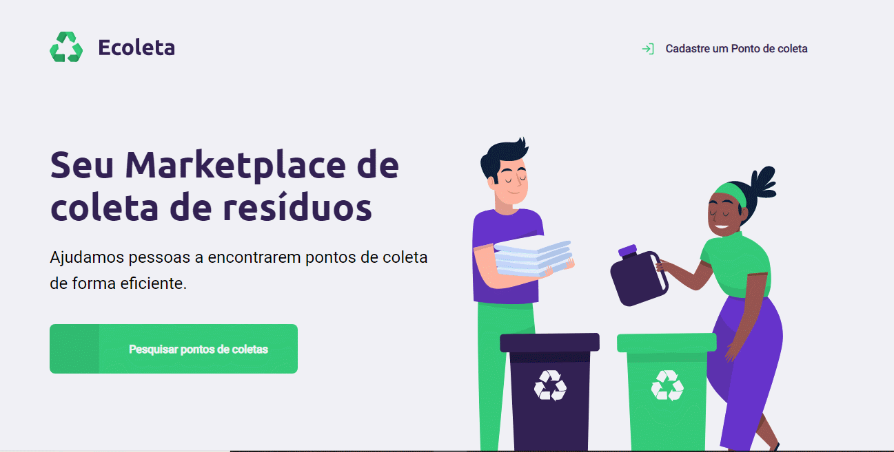
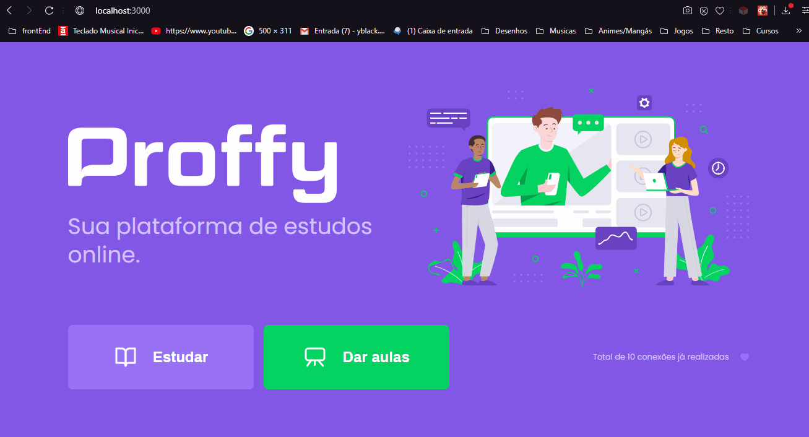
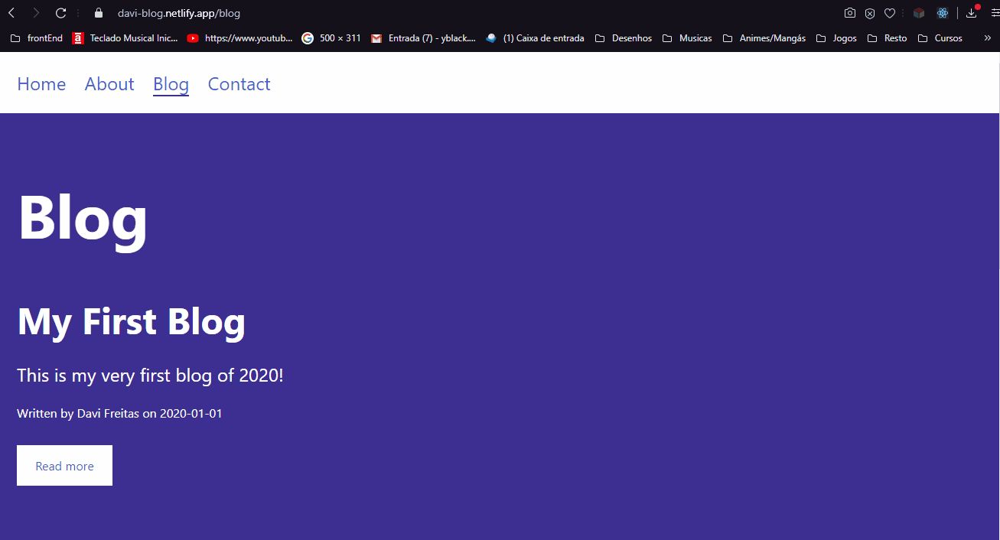

# Portifolio - Davi Freitas da Silva

Este é meu porfifólio onde exponho sites os quais desenvolvi com fim de estudo ou para produção. Mais informações no fim do arquivo.

# 1 - Netflix Clone 

O intuito deste projeto foi aprimorar habilidades com React utilizando JS e CSS.

# 2 - Inova Criciúma

Este site foi desenvolvido durante meu estágio de Desenvolvimento Front-End na Prefeitura de Criciúma para o Programa Inova Criciúma que visa ajudar empreendedores a iniciar e manter suas empresas em nossa região, você pode acessar ele em: https://inova.criciuma.sc.gov.br

# 3 - Ecoleta

Este site foi desenvolvido durante o Bootcamp Next Level Week da Rocketseat com a intenção de se tornar um agregador de pontos de reciclagem.

# 4 - Proffy 

Este site foi desenvolvido durante o segundo Bootcamp Next Level Week da Rocketseat com a intenção de ser uma plataforma para Professores oferecem aulas onlines.

# 5 - Foodfy

Este site foi desenvolvido durante o Curso Launchbase ( Que forma profissionais de front e back end ) da Rocketseat com a intenção de ser uma rede social de Receitas.

# - 6 Academy

Este site foi desenvolvido durante o Curso Launchbase ( Que forma profissionais de front e back end ) da Rocketseat com a intenção de ser um sistema para administração de profissionais e alunos de uma academia.

# 7 - Blog

Este foi um projeto básico para estudos do framework GatsbyJS de um blog.

Mais projetos estão por vir...
Você pode me contatar por (48) 99130-8073 | davi.frrs@outlook.com | https://www.linkedin.com/in/freitasdavi/
